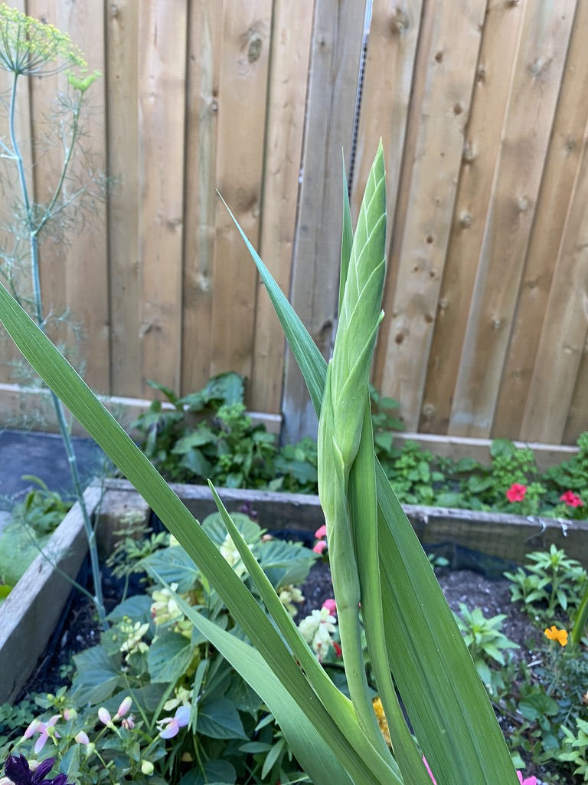
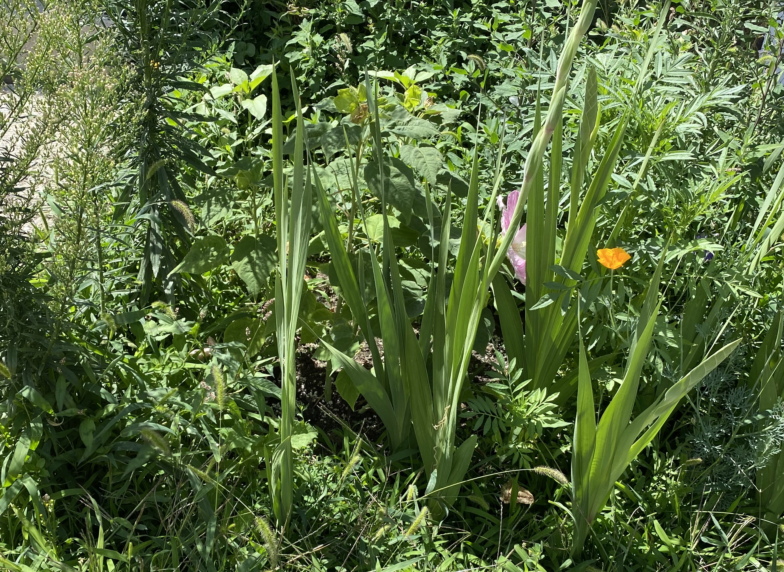

# Motivation

Gardening is my favorite hobby, and I am always thinking about my plants, their growth, and their challenges. One regret I have about this past growing season is that I did not take enough notes to help me to better prepare for the next season. Next season, I intend on collecting more data about my plants and their life cycles to better maintain them and to help know what to expect in the future. My zeal for gardening combined with my passion for data science will allow me to accomplish great things in the coming years. 

# Common Applications of Data in Gardens

Nearly every available seed packet includes information about the recommended plant spacing, the expected plant height, and the days to maturity. Some seed packets even include the probability of a seed being able to germinate. All of these statistics come from extensive research that has been conducted over centuries to develop an understanding of various plant species. 

On a consumer level, machine learning is heavily used in gardening. There are many different apps available, but I use an app called PictureThis to identify plants from a single photo. PictureThis is absurdly accurate. I have been able to successfully identify hundreds of plants at all different stages of growth. Sometimes, the app will only be able to identify the general plant name, but not necessarily the exact cultivar of the plant. For instance, PictureThis may respond by saying that a plant is a cherry tomato, but it won't be able to identify that the variety is "Tiny Tim." I have been fascinated to find that PictureThis can be given a single leaf or a full plant to analyze, and it will be able to detect the correct plant in seconds. Image recognition software makes leafing through plant identification guides a practice of the past. 

# Personal Applications

Where the general gardening data begins to fall short is when I focus solely on my garden specifically. I am in Hardiness Zone 6, which has its own extensive knowledge base, but within my Hardiness Zone, there are many different variables at play. My vegetable beds are on the west side of my house, and they are shaded by trees. As a result, my spring tulips that were planted in the vegetable beds grew at more of a 70-degree angle to the soil, rather than the expected perpendicular, upright posture. While my tulips seemed desperate to find the sunlight, the lettuce that I grew seemed to have no issue growing in the shade. 

The only photos that I could locate that show the same type of plant growing on the sunny east side versus the shady west side of our home are of gladiolus flowers. Gladioli leaves are knife-blade shaped, and they are tall and slender. While the leaves grew at unexpected angles in the shadier part of our garden, the flower stalks grew vertically. 

{width=40%} {width=40%}

The photo below shows the gladioli growing vertically in the sunnier east side of our house. There are quite a few different plants growing in this photo, but the gladioli should be easy to spot with the knife-blade shaped leaves.

A lazy experiment that I conducted this summer was that I took a packet of wildflower seeds and I spread some on the north side of the house, some on the south side, and some on the fully exposed east side of the house. Both the north and the south sides of my house are shaded by our neighbors' houses. The only flowers that bloomed were on the east side of the house that received the most daily sunlight. I did not collect any measurements beyond simply passing observations throughout the summer. 

Moving into the upcoming spring, I will be doing things with a heavier data science influence. I will be tracking the days to maturity for my plants in my specific growing conditions. I will also test different soil types to see how well a chosen plant performs. What I aim to do this spring and summer is to track and record the growth stages of my garden plants, both for my own knowledge of what to expect in years to come, but also for data analysis projects as well. My goal will be to become a better gardener and a better data scientist by making a conscious effort to collect as much data in my garden as I can. 