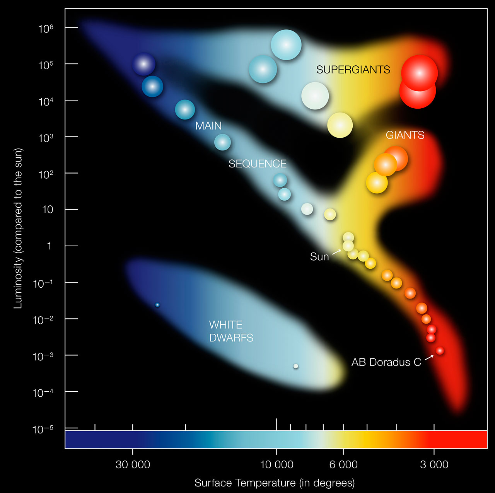

```{r setup, include=FALSE}
knitr::opts_chunk$set(echo = TRUE)
library(png)
library(jpeg)
library(tidyverse)
library(plotly)
library(xgboost)
library(Matrix)
library(pROC)
library(yardstick)
library(caret)
```

# Introduction

I began my undergraduate career as an Astronomy major, and after a few years, I moved on to actuarial science. While I did not finish the astronomy program, my passion for the topic has only grown since moving on. One of the great resources I have come across in my time studying astronomy is the Sloan Digital Sky Survey (SDSS). It is essentially a massive repository of data on stars and exoplanets across the galaxy. In an earlier research project, I used SDSS data to construct my own stellar classification system, and I cross referenced my own diagrams with the widely accepted Hertzprung-Russell Diagram, with reasonable results. 

```{r, echo = FALSE}

link <- 'https://raw.githubusercontent.com/st3vejobs/607-Final-Project/main/10000_sdss_joined.csv'
starsraw <- read.csv(url(link), na.strings = "")

starsna <- starsraw
starsna[starsna == -9999 ] <- NA
starstidy <- starsna %>% na.omit(starsna)

starsfull <- starstidy %>%
  filter(class == "STAR")

stars <- subset(starsfull, select = -c(plate, specobjid, fiberid, plate1, fiberid1, specobjid1, mjd1))

stars$date <- format(as.POSIXct('1858-11-17')+(stars$mjd*24*60*60),"%m-%d-%Y")

stars <- stars %>% 
  relocate(date, .after = mjd)

stars <- stars %>% 
  relocate(bestobjid, elodiervfinal, .after = elodieZErr)

stars <- stars %>% 
  relocate(subclass,teffadop, teffspec, elodieTEff, fehadop, fehspec, elodieFeH, .after = date)

stars <- stars %>% 
  relocate(ra,dec,u,g,r,i,z, .after = fehspec)

stars <- stars %>%
  mutate_if(is.numeric, round, digits = 6)

stars <- stars %>%
  rename(redshift = z1)

stars <- stars %>%
  mutate(temp = (teffadop + teffspec)/2)

stars <- stars %>%
  mutate(metallicity = (fehadop + fehspec)/2)

stars <- stars %>%
  relocate(temp, .before = teffadop)

stars <- stars %>%
  relocate(metallicity, .after = temp)

HR <- subset(stars, select = c(class, elodieBV))
HR$mag <- NA

for (idx in 1:nrow(stars)){
  if (stars[idx, ]$psfmagErr_u <= stars[idx, ]$psfmagErr_g  && stars[idx, ]$psfmagErr_u  <= stars[idx, ]$psfmagErr_r  && stars[idx, ]$psfmagErr_u  <= stars[idx, ]$psfmagErr_i  && stars[idx, ]$psfmagErr_u  <= stars[idx, ]$psfmagErr_z){
    HR[idx, ]$mag <- stars[idx, ]$psfmag_u
  }
  if (stars[idx, ]$psfmagErr_g <= stars[idx, ]$psfmagErr_u  && stars[idx, ]$psfmagErr_g  <= stars[idx, ]$psfmagErr_r  && stars[idx, ]$psfmagErr_g  <= stars[idx, ]$psfmagErr_i  && stars[idx, ]$psfmagErr_g  <= stars[idx, ]$psfmagErr_z){
    HR[idx, ]$mag <- stars[idx, ]$psfmag_g
  }
  if (stars[idx, ]$psfmagErr_r <= stars[idx, ]$psfmagErr_g  && stars[idx, ]$psfmagErr_r  <= stars[idx, ]$psfmagErr_g  && stars[idx, ]$psfmagErr_r  <= stars[idx, ]$psfmagErr_i  && stars[idx, ]$psfmagErr_r  <= stars[idx, ]$psfmagErr_z){
    HR[idx, ]$mag <- stars[idx, ]$psfmag_r
  }
  if (stars[idx, ]$psfmagErr_i <= stars[idx, ]$psfmagErr_g  && stars[idx, ]$psfmagErr_i  <= stars[idx, ]$psfmagErr_r  && stars[idx, ]$psfmagErr_i  <= stars[idx, ]$psfmagErr_u  && stars[idx, ]$psfmagErr_i  <= stars[idx, ]$psfmagErr_z){
    HR[idx, ]$mag <- stars[idx, ]$psfmag_i
  }
  if (stars[idx, ]$psfmagErr_z <= stars[idx, ]$psfmagErr_g  && stars[idx, ]$psfmagErr_z  <= stars[idx, ]$psfmagErr_r  && stars[idx, ]$psfmagErr_z  <= stars[idx, ]$psfmagErr_i  && stars[idx, ]$psfmagErr_z  <= stars[idx, ]$psfmagErr_u){
    HR[idx, ]$mag <- stars[idx, ]$psfmag_z
  }
}

```

```{r,echo=FALSE}

stars$shane_class <- NA
stars <- stars  %>% 
  relocate(shane_class, .after = subclass)
#summary(stars$temp)

for (idx in 1:nrow(stars)){
  if (stars[idx, ]$temp >= 4000 && stars[idx, ]$temp < 5000){
    stars[idx, ]$shane_class <- 'canadian'
  }
  if (stars[idx, ]$temp >= 5000 && stars[idx, ]$temp < 5750){
    stars[idx, ]$shane_class <- 'chilly'
  }
  if (stars[idx, ]$temp >= 5750 && stars[idx, ]$temp < 6250){
    stars[idx, ]$shane_class <- 'sunny'
  }
  if (stars[idx, ]$temp >= 6250 && stars[idx, ]$temp < 7000){
    stars[idx, ]$shane_class <- 'tropical'
  }
  if (stars[idx, ]$temp >= 7000 && stars[idx, ]$temp < 8000){
    stars[idx, ]$shane_class <- 'equatorial'
  }
  if (stars[idx, ]$temp >= 8000 && stars[idx, ]$temp < 9000){
    stars[idx, ]$shane_class <- 'deadly'
  }
}
```


```{r, echo = FALSE}

classcount <- data.frame(table(stars$shane_class))
colnames(classcount) <- c('class', 'population')
ref <- c(1,2,6,5,3,4)
classcount <- classcount %>%
  add_column(ref)
classcount <- classcount %>%
  arrange(ref)


col <- ggplot(classcount, aes(x = factor(ref), y = population, fill = class))+
  geom_col()+
  ylab('Population')+
  xlab('Shane Class')+
  ggtitle('Temperature Distribution of 10,000 Stars')+
  geom_text(
    aes(label = population),
    vjust = 2
  )+
  scale_x_discrete(labels = c("1" = "Canadian","2" = "Chilly", "3" = "Sunny","4" = "Tropical","5" = "Equatorial", "6" = "Deadly"))+
  theme(plot.title = element_text(hjust = 0.5))

```


```{r, echo = FALSE, fig.show= 'hide'}
# Temp Distribution

h1 <- ggplot(stars, aes(x=temp))+
  geom_histogram(aes(y=..density..), color = 'blue4', fill = 'darkorchid3', binwidth = 150)+
  geom_density(alpha=.2, fill = 'darkgreen')+
  ggtitle('Temperature Distribution of 10,000 Stars')+
  theme(plot.title = element_text(hjust = 0.5))+
  xlab('Temperature')+
  ylab('Density')

stars_trim <- subset(stars, temp >= 5200 & temp <= 6600)

h2 <- ggplot(stars_trim, aes(x=temp))+
  geom_histogram(aes(y=..density..), color = 'blue4', fill = 'darkorchid3', binwidth = 75)+
  geom_density(alpha=.2, fill = 'darkgreen')+
  ggtitle('Temperature Distribution of 10,000 Stars')+
  theme(plot.title = element_text(hjust = 0.5))+
  xlab('Temperature')+
  ylab('Density')

```

```{r, echo = FALSE}

cluster_temp_mag <- ggplot(stars, aes(x = temp, y = HR$mag, na.rm = TRUE))+
  geom_point(na.rm = TRUE, color = 'darkorchid4')+
  geom_smooth(color = "azure4")+
  geom_smooth(method = "lm", color = "red", se = FALSE)+
  ggtitle("Relationship Between Temperature and Magnitude")+
  xlab("Temperature")+
  ylab("Magnitude")+
  theme(plot.title = element_text(hjust = 0.5, size = 10))

```

```{r, echo = FALSE}

fit <- lm(HR$mag ~ temp, data = stars)
#summary(fit)

set.seed(16)
x <- runif(1, min(stars$temp), max(stars$temp))
eq <- .00009165*x + 16.72

#paste("Predicted Magnitude value for a given temperature such as: ", round(x, 3), "Magnitude: ", round(eq, 3))


idx <- as.numeric(which.min(abs(x - stars$temp)))
near <- stars$temp[idx]
#near
resid <- eq - HR$mag[idx]
#paste("Residual: ", resid)

p3 <- ggplot(data = fit, aes(x = .fitted, y = .resid)) +
  geom_point() +
  geom_hline(yintercept = 0, linetype = "dashed", color = 'red') +
  xlab("Fitted values") +
  ylab("Residuals") +
  ggtitle("Linearity of Residuals")+
  theme(plot.title = element_text(hjust = 0.5))


p4 <- ggplot(data = fit, aes(x = .resid)) +
  geom_histogram(binwidth = 0.5) +
  xlab("Residuals") +
  ggtitle("Histogram of Residuals")+
  theme(plot.title = element_text(hjust = 0.5))


p5 <- ggplot(data = fit, aes(sample = .resid)) +
  stat_qq()+
  ggtitle("Normal Probability Plot of Residuals")+
  theme(plot.title = element_text(hjust = 0.5))

```

# Temperature-Magnitude Diagram

```{r, echo = FALSE,warning=FALSE,message=FALSE}

link <- 'https://raw.githubusercontent.com/st3vejobs/607-Final-Project/main/nasa_HR_set.csv'
hr <- read.csv(url(link), na.strings = "")

fig_1 <- ggplot(hr, aes(x = Temperature, y = A_M, color = Spectral_Class))+
  geom_point()+
  scale_x_reverse(lim = c(40000,1000))+
  scale_y_reverse(lim = c(15, -10))+
  ggtitle("Hertzprung-Russell Diagram")+
  xlab("Temperature")+
  ylab("Absolute Magnitude")+
  theme(plot.title = element_text(hjust = 0.5))

fig_1
#img1 <- readJPEG("HR_diagram.PNG")

#im_1 <- ggplot()+
#  background_image(img1)+
# theme(plot.margin = margin(t=1,l=1,r=1,b=1, unit = "cm"))

#im_1

```

## Universally Accepted Hertzprung-Russell Diagram




# Improving the Classification System: 

I previously used logistic regression to predict the class of different stars. I would like to revisit it and see if I can use xgboost to classify the stars in my dataset. I will be using a dataset with 240 variables, and I will simply split the data and load it into xgboost for analysis. I am curious to see how the classification will work with multiple numeric columns. xgboost is great at taking sparse matrices and detecting patterns. Fortunately, there are not too many spectral classes, because they do need to be encoded to numeric variables for xgboost to work properly. 

In this sample, there is only one G-Class star, so the model will have trouble if it faces the one G-Class star. I will drop the "Type" column because that is more or less covered in the temperature. The "Type" is a number from 0 to 9, and it denotes the temperature scale of the stars in each class (0 is the hottest, 9 is the coolest).

Another problem that xgboost will run into with classification is that if you split the train and test set prior to creating a sparse matrix, you will likely run across an issue where you don't have the same predictor variables in the train and test matrices anymore. The way around this is to split the set AFTER constructing the sparse matrix. 

```{r,echo = FALSE,warning=FALSE,message=FALSE}

link <- 'https://raw.githubusercontent.com/st3vejobs/607-Final-Project/main/nasa_HR_set.csv'
hr <- read.csv(url(link), na.strings = "")

hr <- hr %>%
  rename(label = Spectral_Class)

#head(hr)

#unique(hr$label)

labels <- c("M" = 0, "B" = 1,"A" = 2,"F" = 3,"O" = 4,"K" = 5,"G" = 6)

hr_archive <- hr
hr <- transform(hr, label = labels[as.character(label)])

hr <- hr[,-c(7)]

set.seed(34);
sample_rows <- sample(nrow(hr),nrow(hr) *.7)

dt <- sort(sample_rows)

test <- hr[-dt,]
train <- hr[dt,]

#XGBoost needs a matrix as input.

# It is CRITICAL that you make the sparse matrix prior to splitting the data in order for the algorithm to properly receive all the same columns in the test and train sets. 
full_mat <- sparse.model.matrix(label~.-1,data=hr)

trainm <- full_mat[dt,]

#trainm <- sparse.model.matrix(label ~ .-1,data = train)
train_label <- train[,"label"]

train_matrix <- xgb.DMatrix(data = as.matrix(trainm), label = train_label)

testm <- full_mat[-dt,]
#testm <- sparse.model.matrix(label~.-1,data = test)
test_label <- test[,"label"]
test_matrix <- xgb.DMatrix(data = testm, label = test_label)


nc <- length(unique(train_label))

xgb_params <- list("objective" = "multi:softmax","eval_metric" = "mlogloss", "num_class" = nc,"eta" = 0.01,verbose=0)

watchlist <- list(train = train_matrix, test = test_matrix)

# XGBoost Model

#100 iterations is overkill, trimming to 10
# Eta should be tweaked as well. Eta is 0.3 by default. Set to 0.01 (As small as possible)
# Because the dataset is very small and it won't be too heavy to complete. 

xgb_model <- xgb.train(params = xgb_params, data = train_matrix, nrounds = 500, watchlist = watchlist,verbose=0,verbosity = 0)

e <- data.frame(xgb_model$evaluation_log)

ggplot(e, aes(iter,train_mlogloss))+
  geom_point(color = 'green',shape = 0)+
  geom_line(data = e, aes(x=iter,y=test_mlogloss),color = 'red')+
  ggtitle("XGBoost Model Log Loss vs. Number of Iterations")+
  theme(plot.title = element_text(hjust = 0.5))
  
# The plot shows that we start losing value after 10 iterations, so 10 iterations is a good amount for this model. 
#which(e$test_mlogloss == min(e$test_mlogloss))

imp <- xgb.importance(colnames(train_matrix),model = xgb_model)
xgb.plot.importance(imp)
#milk is the most important variable for predicting class. 

p <- predict(xgb_model,newdata = test_matrix)

#pred <- matrix(p, nrow = nc, ncol = length(p)) %>%
#  t() %>%
#  data.frame() %>%
#  mutate(label = test_label,max_prob = max.col(.,"last") - 1)

pred <- data.frame(cbind(p, test_label))

pred$correct <- pred$p == pred$test_label

table(Prediction = pred$p,Actual = pred$test_label)

table(pred$correct)

```


## Reaction: 

To show how easy it can be, I intentionally did not tune the hyperparameters. I am sure this model can be even further improved. With nearly no tuning involved, I was able to correctly classify 67 out of 72 stars based on 5 criteria. xgboost is an incredible tool that should not be overlooked. 


# Mapping the Universe

## 2-D Cartesian

```{r, echo = FALSE}

stars$coord_x <- cos(stars$ra)*cos(stars$dec)
stars$coord_y <- sin(stars$ra)*cos(stars$dec)
stars$coord_z <- sin(stars$dec)
stars$coord_rz <- stars$redshift*sin(stars$dec)

stars$pol_r <- sqrt((stars$coord_x^2) + (stars$coord_y^2))
stars$pol_theta <- atan((stars$coord_y/stars$coord_x))

ggplot(stars)+
  geom_point(aes(x = coord_x, y = coord_y, color = shane_class))
```


## 2-D Polar

```{r, echo = FALSE}

ggplot(stars, aes(x = pol_r, y = pol_theta))+
  geom_point(aes(x = pol_r, y = pol_theta, color = shane_class))+
  coord_polar("y")

```

## 3-D With Uniform Radius

```{r, echo = FALSE}

plot_ly(stars, x = stars$coord_x, y = stars$coord_y, z = stars$coord_z, color = stars$shane_class) %>%
  add_markers() %>%
  layout(title = list(text = "Star Map With Uniform Radius = 1", y = 0.98))
  
```

## 3-D With R = Observed Redshift

```{r, echo = FALSE}

plot_ly(stars, x = stars$coord_x, y = stars$coord_y, z = stars$coord_rz, color = stars$shane_class) %>%
  add_markers() %>%
  layout(title = list(text = "Star Map With Radius = Redshift", y = 0.98))
```


# Appendix: xgboost Code

```{r,eval = FALSE}

link <- 'https://raw.githubusercontent.com/st3vejobs/607-Final-Project/main/nasa_HR_set.csv'
hr <- read.csv(url(link), na.strings = "")

hr <- hr %>%
  rename(label = Spectral_Class)

head(hr)

unique(hr$label)

labels <- c("M" = 0, "B" = 1,"A" = 2,"F" = 3,"O" = 4,"K" = 5,"G" = 6)

hr_archive <- hr
hr <- transform(hr, label = labels[as.character(label)])

hr <- hr[,-c(7)]

set.seed(34);
sample_rows <- sample(nrow(hr),nrow(hr) *.7)

dt <- sort(sample_rows)

test <- hr[-dt,]
train <- hr[dt,]

#XGBoost needs a matrix as input.

# It is CRITICAL that you make the sparse matrix prior to splitting the data in order for the algorithm to properly receive all the same columns in the test and train sets. 
full_mat <- sparse.model.matrix(label~.-1,data=hr)

trainm <- full_mat[dt,]

#trainm <- sparse.model.matrix(label ~ .-1,data = train)
train_label <- train[,"label"]

train_matrix <- xgb.DMatrix(data = as.matrix(trainm), label = train_label)

testm <- full_mat[-dt,]
#testm <- sparse.model.matrix(label~.-1,data = test)
test_label <- test[,"label"]
test_matrix <- xgb.DMatrix(data = testm, label = test_label)


nc <- length(unique(train_label))

xgb_params <- list("objective" = "multi:softmax","eval_metric" = "mlogloss", "num_class" = nc,"eta" = 0.01,"silent" = 1)

watchlist <- list(train = train_matrix, test = test_matrix)

# XGBoost Model

#100 iterations is overkill, trimming to 10
# Eta should be tweaked as well. Eta is 0.3 by default. Set to 0.01 (As small as possible)
# Because the dataset is very small and it won't be too heavy to complete. 

xgb_model <- xgb.train(params = xgb_params, data = train_matrix, nrounds = 500, watchlist = watchlist,verbose = 0)

e <- data.frame(xgb_model$evaluation_log)

ggplot(e, aes(iter,train_mlogloss))+
  geom_point(color = 'green',shape = 0)+
  geom_line(data = e, aes(x=iter,y=test_mlogloss),color = 'red')+
  ggtitle("XGBoost Model Log Loss vs. Number of Iterations")+
  theme(plot.title = element_text(hjust = 0.5))
  
# The plot shows that we start losing value after 10 iterations, so 10 iterations is a good amount for this model. 
#which(e$test_mlogloss == min(e$test_mlogloss))

imp <- xgb.importance(colnames(train_matrix),model = xgb_model)
xgb.plot.importance(imp)
#milk is the most important variable for predicting class. 

p <- predict(xgb_model,newdata = test_matrix)

#pred <- matrix(p, nrow = nc, ncol = length(p)) %>%
#  t() %>%
#  data.frame() %>%
#  mutate(label = test_label,max_prob = max.col(.,"last") - 1)

pred <- data.frame(cbind(p, test_label))

pred$correct <- pred$p == pred$test_label

table(Prediction = pred$p,Actual = pred$test_label)

table(pred$correct)

```
